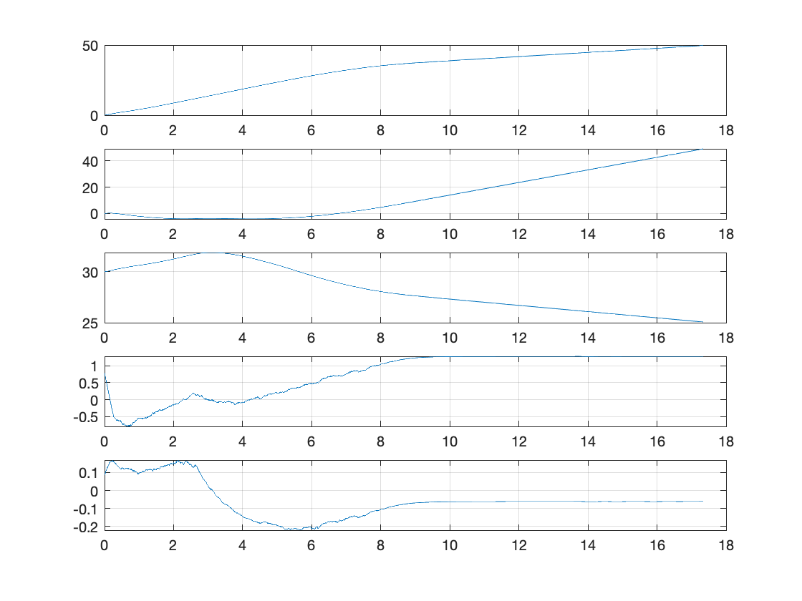
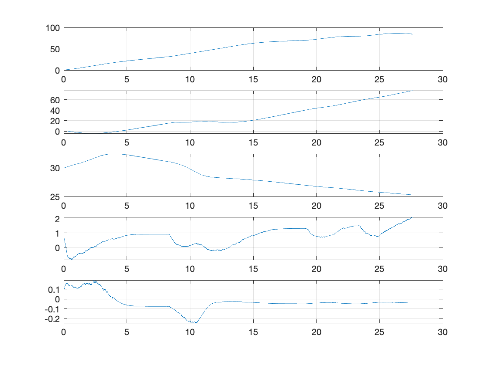
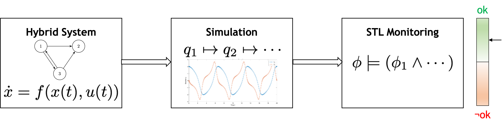

Fixed-Wing Motion Planning
==========================
This repository contains code for doing motion-planning of fixed-wing UAVs. 

I take a Correct-by-Design approach of validating that a given candidate motion-planner satisfies the system 
specifications by using formal methods. Specifically, I make use of a tool called 
[S-Taliro](https://sites.google.com/a/asu.edu/s-taliro/s-taliro), which uses Metric Temporal Logic (MTL) to get 
incrementally close to falsifying the specifications.

------------------------------------
## Motion-Planner Demos
### Demo 1: Go Around Obstacle

### Demo 2: Minefield of Obstacles

## System Dynamics
The system is governed by the following system of differential equations.

The system is subject to several Pfaffian constraints prohibiting sliding in the xy-plane and along the z-axis.

The dynamics are being extended to account for roll, accelerations, and external forces.

## Reactive Motion-Planner
The UAV is only aware of what's within its direct line-of-sight up to certain, configurable distance. In other words, 
the UAV is unaware of the presence of different obstacles until it comes close to them. 

Therefore, the motion-planner is not finding the optimal path from the starting configuration to the target 
configuration subject to the constraints due to the dynamics and due to the obstacles, as would be done in an 
optimization centric approach. 

Instead, a global controller points aircraft in the direction of the target configuration, and if an obstacle is 
detected nearby, the reactive controller is switch on. The reactive controller applies control inputs that avoid the 
obstacles. Specifically, the reactive controller uses Virtual Potential Fields to generate control inputs that will 
avoid the obstacles.

## Metric Temporal Logic using S-Taliro
The following diagram depicts the transition from a definition of a hybrid system (a system containing continuous 
dynamics and discrete states) to the system simulation, finally to the specification monitoring, where we measure how 
well the system satisfies the specifications.

The system specifications are:
1. The UAV should _eventually_ reach the __target configuration__.
2. The UAV should _never_ enter an __unsafe state__.
    - An unsafe state is any state of the aircraft has either crashed into an object or can't avoid crashing into the 
   object anymore.

